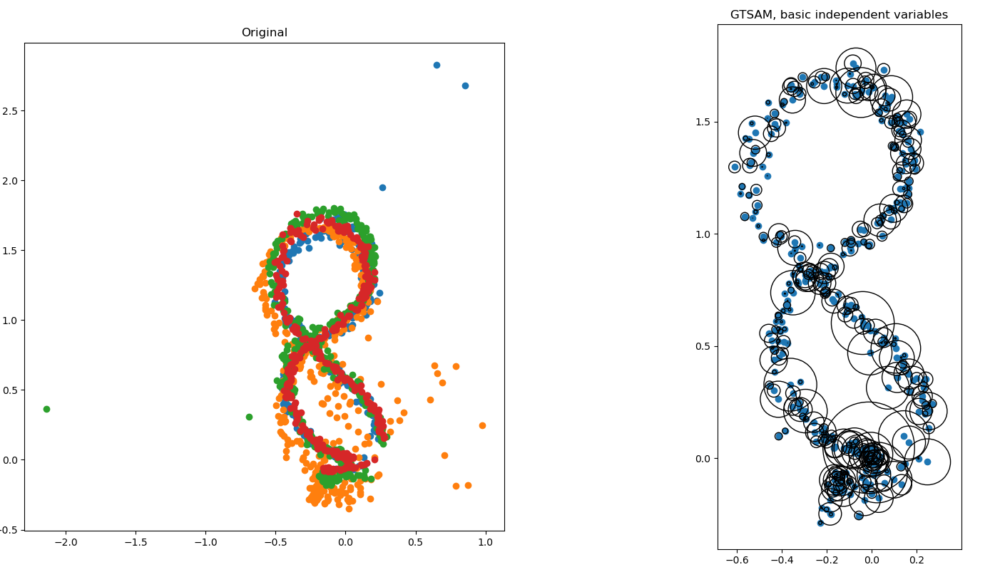
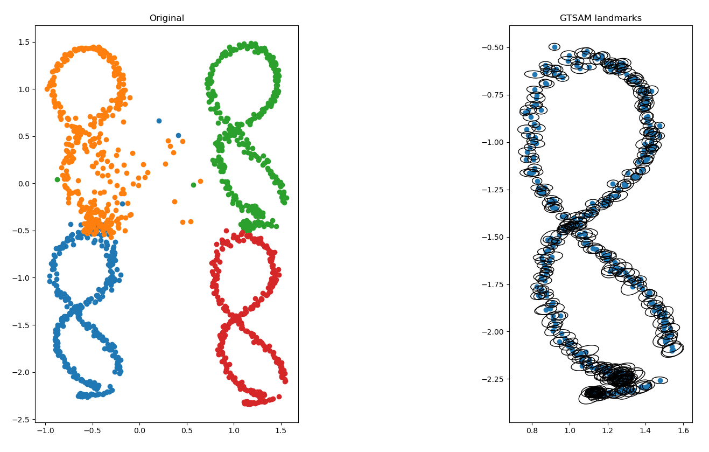

# Camera Localization using GTSAM and AprilTags

## Introduction (Motivation) and Related Work

As technology improves and software capabilities increase, autonomous robots have
become more and more prevalent. One of the most fundamental parts of an autonomous robotics
system is positioning and orientation of the robot. With this project, we attempt to explore the
capabilities of the [GTSAM library](https://github.com/borglab/gtsam) for camera localization using AprilTags,
with the eventual goal of attaining localization that is more precise and stable than can be achieved with a single
AprilTag alone.

### Related Works

* [AprilTag: A Robust and Flexible Visual Fiducial System](https://april.eecs.umich.edu/papers/details.php?name=olson2011tags)
* [Flexible Layouts for Fiducial Tags](https://april.eecs.umich.edu/papers/details.php?name=krogius2019iros)
* [Factor Graphs for Robot Perception](http://www.cs.cmu.edu/~kaess/pub/Dellaert17fnt.pdf)
* [Factor Graphs and GTSAM: A Hands-on Introduction](https://repository.gatech.edu/entities/publication/0c2ac17c-1df4-48fe-8532-8f746868934a)

## Theory, Metric Information, and Background

### AprilTags
AprilTags are a type of fiducial markers used in computer vision applications for pose estimation and tracking. They are
essentially square-shaped patterns consisting of black and white pixels arranged in a specific configuration. Each tag
has a unique ID encoded within it, allowing for easy identification and differentiation between multiple tags.

The working principle of AprilTags involves a two-step process: detection and decoding. In the detection step, an image
or video frame captured by a camera is analyzed to locate the tags.  

The general idea for the detection step is that we want to find four-sided regions (quads) in the image that
have darker interiors than exteriors.  The algorithm starts by computing the gradient at every pixel, computing the
magnitude and direction of the gradient.  It then clusters the pixels into regions of similar gradient direction, and
then tries to fit lines to the edges of the regions.  Quads are then formed by a recursive depth-first search; the
quads are then passed to the decoder to get the data payload.

Since the tags are of a known size, we can easily determine the distance between the camera and the tag and the relative
orientation by analyzing the detected tag in the image.  AprilTag: A Robust and Flexible Visual Fiducial System goes into
more detail about the specifics of the math behind the computation of the distance and orientation, but it's very similar
to what we've already done in class.

### GTSAM
GTSAM is a C++ library that implements smoothing and mapping (SAM) in robotics and vision, using factor graphs and
Bayesian networks as the underlying computing paradigm rather than sparse matrices.  It is a library that can be used
for solving inference problems in robotics and vision, such as localization, mapping, SLAM, and sensor fusion.  It
provides a flexible and efficient implementation of SAM, and is designed to work with large-scale problems. It is
developed by the [Borg Lab](https://borg.cc.gatech.edu/) at Georgia Tech.

Factor graphs are a way of representing a probability distribution over a set of variables.  They are a generalization
of Bayesian networks, and are a way of representing a probability distribution over a set of variables.  They are
composed of variables and factors.  Variables are the unknowns in the system, and factors are the constraints on the
variables.  The goal is to find the most likely values for the variables given the constraints.  The variables are
represented by nodes in the graph, and the factors are represented by edges. 

### Metric
The metric we decided to use for testing the smoothing power of our algorithms is the average absolute acceleration.  We
chose this metric because it's simple to compute, and makes sense; noisy, jittery positional data will end up
corresponding to a high acceleration, while smooth positional data will correspond to a low acceleration.  We compute
it as follows:

```math
\[
\Bar{v}=|\frac{1}{n}\sum_{i=1}^{n} x_i - x_{i-1}|
\]
```

```math
\[
\Bar{a}=|\frac{1}{n}\sum_{i=1}^{n} v_i - v_{i-1}|
\]
```

## Approach, Implementation, and Results

### Implementation
Our main goal with this project was to show that we could get a more stable result with GTSAM combining our AprilTag
localization data than we could with a single AprilTag alone.  To do this, we ended up with three different programs:

* `apriltag_baseline.py`: This is our baseline detector.  It doesn't use GTSAM at all, and just computes pose independently for each of the four visible tags.  It also plots the mean of the four camera positions.
* `gtsam_basic_noise.py`: This is the first attempt at using GTSAM.  It still computes the camera pose independently for each of the four visible tags, but then uses GTSAM to combine the four poses into a single pose estimate.  It also propigates the reported noise from the AprilTag detections into the GTSAM graph.
* `gtsam_landmark.py`: This is the final version of our program.  Instead of computing the camera pose directly from the tag detection, it instead creates 4 nodes in the graph for the tag positions, then uses the reported position and orientation of the tags relative to the camera to create a BearingRangeFactor3D between the camera and the tag.  It then uses GTSAM to estimate the camera pose and the tag positions simultaneously.


### Usage and Replication instructions
The testing environment was set up by printing out AprilTags numbered 00-03, and placing them in a 1x1 meter square on a
wall.  We measured the size of the printed tags to be 19.2cm per side.  To calibrate the camera, we printed out a 8x8
chessboard, then scratched out one row of corners to make it 5x7 for the purposes of the calibration; this allows us
to better orient the board.

If you want to replicate these results with your own camera, you'll need to start by calibrating it.  To do this, you
need to print out a chessboard; either print a 6x8 one, or print an 8x8 and scratch out the corners like we did.  
Measure the side length of the long side of the board in meters, then plug it into the `calibrate_camera.py` script.  
You'll then take a video of the chessboard with your camera and run the `calibrate_camera.py` script on it.  This gives
you values for the camera intrinsics (fx, fy, cx, cy) which can be put into the `apriltag_baseline.py` script.

Once you've calibrated your camera, the next step will be printing out and mounting the AprilTags.  They don't need
to be mounted in a 1x1 meter square like we did; they just need to be in a fixed configuration relative to each other.
You'll need to measure the side length of the tags in meters, and plug that into the `apriltag_baseline.py` script as 
well.

Once you've done all of the above setup, you should be ready to run the actual scripts!  Running `apriltag_baseline.py`
will plot baseline results; `gtsam_basic_noise.py` will plot the results of the first GTSAM implementation, and
`gtsam_landmark.py` will plot the results of the final GTSAM implementation.

### Results and Discussion

#### Baseline


#### GTSAM Basic


#### GTSAM Landmark


Our results were mixed.  While GTSAM was able to help us reject outliers, it also didn't perform nearly as much smoothing
as we got with a simple mean of the four tag positions.  This may be because we didn't set up our graph with enough
factors; in both implementations, there was only one factor per tag per frame, and we computed the tag pose *before*
feeding it to GTSAM.

Additionally, we didn't have enough time to implement the IMU factor, like we originally hoped to.  Due to unforeseen
issues setting up the Raspberry Pi, we weren't able to get the IMU data in time to implement it.  We believe that this
could have a very significant impact on our results; we don't have any odometry data available, so the IMU might work
as a good substitute for that.  Future work would involve implementing the IMU factor, and also adding more factors to
the graph to see if that improves the results.